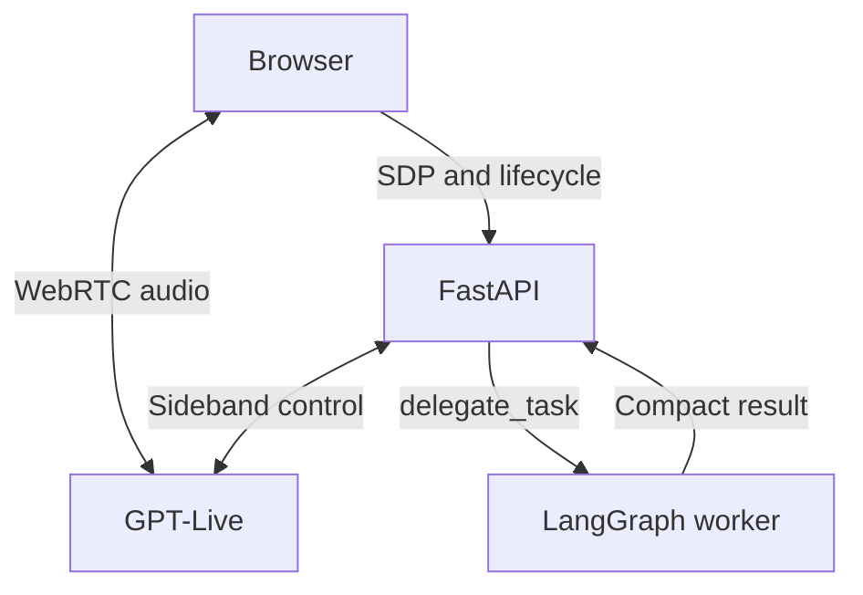

# voice-delegate

[](https://github.com/savbiz/voice-delegate/actions/workflows/ci.yml)
[](LICENSE)

**A reference architecture for real-time voice agents that stay responsive while doing real work.**

A speech-to-speech model (GPT-Live over WebRTC) owns the conversation. Anything slower than a
sentence is handed to a separate LangGraph worker through a single `delegate_task` boundary, and
narrated back when it completes. The user can interrupt at any time: an interrupted task can
never be spoken late. Every buffer, queue and session has an explicit budget, and every turn is
traced end to end.

Built clean-room from public provider documentation. Apache-2.0, copyright 2026 Savino Bizzoca.

<!-- TODO(v0.1.0): replace with docs/media/demo.gif recorded during the live smoke test:
     connect, ask a question, delegate a calculation, interrupt mid-answer, inspect timings, end. -->



## Why it exists

Voice agents fail in two ways: they go quiet while a tool runs, or they keep talking over a
result that is no longer wanted. This project shows one way to avoid both:

- **One delegation entry point.** The voice model knows a single tool; the worker evolves and
  is tested on its own.
- **Interruption invalidates work.** A generation counter is bumped before cancellation, so a
  late worker result is discarded rather than narrated.
- **Bounded everything.** Sessions, buffers, history, worker steps and result size have limits
  with a documented reason and a documented behaviour on exhaustion.
- **Provider failover with clamped history.** A primary transport failure reconnects to a
  fallback provider and replays bounded text, never tool executions.
- **Measured, not assumed.** OpenTelemetry spans per turn, provider time-to-first-byte,
  delegation latency and failover count; offline evals for scheduling and limits.

## Status

**v0.1.0 candidate.** M1–M4 (sessions, delegation, failover, observability) are implemented
and pass the offline suite in CI. Live verification with a real provider, recorded demo and
measured latency are the release gates and are tracked in [docs/roadmap.md](docs/roadmap.md).
Later milestones (invitations and quotas, cited documentation search, multilingual controls,
same-host scaling) are implemented candidates and documented separately.

<!-- TODO(v0.1.0): fill from the live smoke test; keep p50/p95 and the exact model names.
| Measurement | p50 | p95 | Notes |
|---|---|---|---|
| Provider time-to-first-byte |  |  | gpt-live-1, WebRTC, EU |
| Delegated task end-to-end |  |  | offline planner / gpt-4.1-mini |
| Failover to Azure |  |  | injected sideband failure |
-->

## Quickstart — no API key required for the simulated demo

Prerequisites: Python 3.12, uv, Node.js 24 and pnpm 11.19.0. Open the extracted `voice-delegate/` folder containing `pyproject.toml` in PyCharm.

```bash
cd voice-delegate
uv sync --locked
cp .env.example .env
pnpm --dir frontend install --frozen-lockfile
pnpm --dir frontend dev
```

Open **http://localhost:5173** and press **Start demo**. This mode is free, scripted and silent: no API calls, microphone or generated speech. Simulated timings are labeled.

For live voice, set `OPENAI_API_KEY` in root `.env`, then in a second terminal from the repository root:

```bash
uv run uvicorn voice_delegate.api.app:create_app --factory --reload --host 127.0.0.1 --port 8000
```

Select **Live voice** in the browser. Provider access and usage billing are required. Keys stay on the server. Use one backend worker; sessions are held in memory.

See [PyCharm and local development](docs/local-development.md) and [GitHub, Vercel, Railway/Render deployment](deployment/README.md).

## Repository

| Directory | Responsibility |
|---|---|
| `frontend/` | React 19, TypeScript, Vite 8, Tailwind 4, Vitest, Playwright, pnpm |
| `backend/src/voice_delegate/` | FastAPI, Pydantic, httpx, provider/session/limits modules |
| `backend/tests/` | Offline pytest tests; uv, Ruff and strict mypy configured at root |
| `agent/` | LangGraph worker, offline/OpenAI planners, read-only tools |
| `observability/` | Optional OTel collector and tracing setup |
| `realtime/` | WebRTC boundary documentation; browser controller lives in frontend |
| `deployment/` | Backend Dockerfile and deployment guide |
| `evals/`, `docs/` | Evaluation boundaries, architecture and ADRs |

## What is implemented

- Application session creation and ownership keys; duplicate-offer protection.
- Server-mediated GPT-Live WebRTC SDP exchange and server-side event connection.
- Start/end browser controls, microphone cleanup, independent bounded captions, estimated per-turn transcript gaps.
- Absolute lifetime, browser heartbeat expiry, request size and session capacity limits.
- Bounded WebSocket/event queues and graceful close with explicit confirmed/unconfirmed finalization.
- LangGraph delegation with offline/OpenAI planners, timeout, result clipping and interruption cancellation.
- Python 3.12, uv lockfile, Ruff, strict mypy, pytest-asyncio, a fake control provider, and GitHub Actions workflow.

GPT-Live uses client delegation. `delegate_task(goal, context)` is the **internal worker contract**, not a voice-model function schema. M2 starts an asynchronous worker and returns compact commentary. `VOICE_WORKER_MODE=offline` uses a scripted planner by default; set `openai` for natural-language tool selection. No web search or external actions are available.

The capability-aware `/token` endpoint returns **501** for this adapter. Live's documented browser flow creates sessions using server credentials and SDP; this project does not invent a Live ephemeral credential API. The browser uses `/offer`. See [ADR 001](docs/decisions/001-live-client-delegation.md).

## Why this design

- **One delegation entry point:** the conversation layer need not carry every tool schema or workflow. The worker can evolve and be tested independently. GPT-Live's native delegation maps into the same application boundary.
- **Bounded buffers:** a slow consumer must not accumulate unlimited events or increasingly stale speech. M1 bounds application events and WebSocket buffers; the browser/provider own WebRTC audio buffers. There is no Python audio relay.
- **Clamp history:** future reconnections and worker requests need relevant context within a known cost and latency budget. M2 retains bounded transcript context for worker requests; M3 replays bounded sealed text segments; see its documented heuristic limits.
- **Trace per turn:** a user-visible interaction should correlate provider activity, worker execution, and interruptions. M4 adds application-defined turn spans; full-duplex transcript fragments are not reliable turn boundaries on their own.
- **Fake provider for evals:** reproducible failure sequences and injected clocks make lifecycle behavior testable without credentials. Scripted tests verify orchestration, not a real model's delegation quality or network latency. Live model-quality and audio-latency measurements remain separate.

## Try the real worker offline

```bash
uv run python -m voice_delegate.delegation.demo "calculate (120 + 80) * 1.22"
```

This executes the LangGraph graph and calculator without any API call and returns 244. See [M2](docs/m2.md) for enabling the paid text model and testing interruption.

## Verification

```bash
uv run ruff check .
uv run ruff format --check .
uv run mypy
uv run pytest
pnpm --dir frontend build
pnpm --dir frontend test
pnpm --dir frontend test:e2e
uv build --all-packages
```

Pytest disables IP sockets; only local Unix sockets used by asyncio are allowed. HTTP tests use in-process ASGI and mock transports. Test fixtures contain invented identifiers and no recordings from private systems. Dependency installation needs internet; the tests themselves do not.

See [the live smoke-test checklist](docs/m1-verification.md). No API key, real microphone test, paid provider call, or hosted GitHub Actions run was used to validate this candidate.

## Timing and cleanup limitations

The UI measures an **estimated transcript gap**, not audio TTFB or end-to-end playback latency. Transcript timestamps can overlap; negative values are retained. Turns are approximated by 800 ms gaps between user transcript fragments. M4 exports separate turn, provider, delegation and failover metrics; see [observability](observability/README.md).

The provider creation POST is never automatically retried: an ambiguous response can already have created a billable session. If the sideband fails after creation, the adapter attempts to recover it solely to close the session. If recovery fails, remote finalization cannot be guaranteed and is logged as unconfirmed. The public hangup reference describes SIP, so M1 does not assume it works for WebRTC. A process crash also cannot guarantee remote cleanup. A normal close waits for `session.closed` before releasing transports.

## Roadmap and release gates

The full plan includes **M1–M8**: see [scope, acceptance and status](docs/roadmap.md).
The table below covers the original v0.1 milestones; M5–M8 extend it with a controlled
public demo, a complete use case, advanced voice UX and optional scaling.

| Week | Milestone | Release gate |
|---|---|---|
| 1 | M1: GPT-Live sessions, provider contract, browser | Offline checks + real voice, interruption, and cleanup smoke test; then `v0.1.0-m1` |
| 2 | M2: LangGraph worker, internal delegation, token budget, cancellation | Offline worker tests + live delegated response; `v0.1.0-m2` |
| 3 | M3: Azure Realtime adapter, renegotiation failover, clamped history | Capability checks and timed fallback scenarios; `v0.1.0-m3` |
| 4 | M4: OTel, collector, Prometheus, Grafana dashboard, evals, docs | Reproducible offline suite + explicitly separate live validation; `v0.1.0` |

The v0.2 candidate adds language/mirror preferences, an extractive interruption recap and OpenAI Realtime. M8 adds a same-host multi-process topology. ElevenLabs and cross-host high availability remain future extensions.

The Azure adapter uses documented GA WebRTC and sideband capabilities. A provider change establishes a new browser peer connection and replays bounded text; it does not transparently migrate audio or imply identical full-duplex behavior.

## Public sources

Protocol implementation is based on the public OpenAI [WebRTC guide](https://developers.openai.com/api/docs/guides/voice-webrtc?api=live), [server controls](https://developers.openai.com/api/docs/guides/voice-server-controls?api=live), [session lifecycle](https://developers.openai.com/api/docs/guides/live-conversations), and [delegation guide](https://developers.openai.com/api/docs/guides/live-delegation). See [architecture](docs/architecture.md) and [ADRs](docs/decisions/) for application-level reasoning and feature boundaries.
