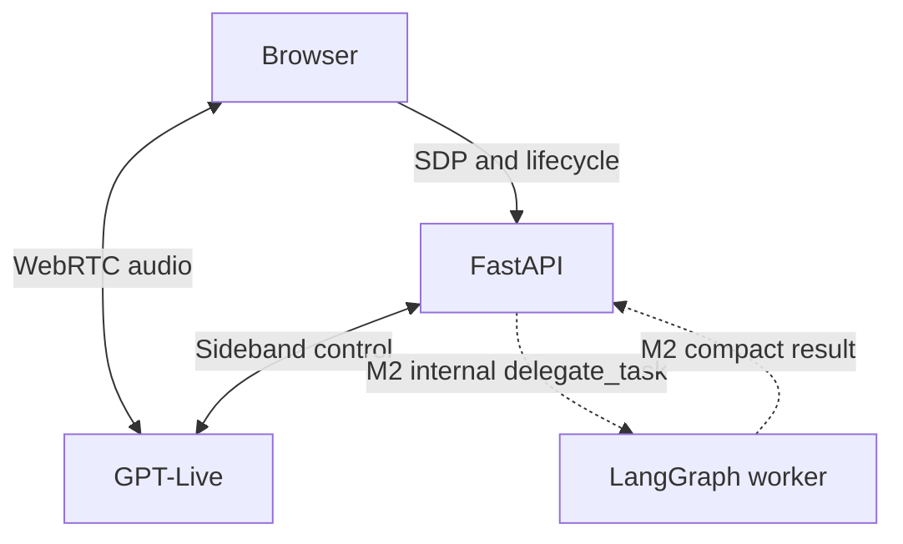

# voice-delegate

A small, clean-room reference architecture for real-time voice agents: GPT-Live handles the conversation over WebRTC while a separate worker will handle delegated reasoning and tools. FastAPI owns session lifetime and server-side control; provider contracts make transport differences explicit. The project is designed to make cancellation, resource budgets, and failure recovery understandable and testable. Working name; Apache-2.0. Copyright 2026 Savino Bizzoca.

**Status: M1 implementation candidate (`0.1.0.dev1`).** The Python scaffold, GPT-Live adapter, lifecycle service, browser client, and offline CI are implemented. Real microphone/speaker verification is still required before tagging M1. M2–M4 remain roadmap items, not shipped features.



**90-second demo GIF:** placeholder — record after the live M1 smoke test. Suggested sequence: connect, speak, interrupt, inspect timing, end; add delegation when M2 ships.

## Quickstart

Prerequisites: Python 3.12, uv, Node.js 24, and a personal OpenAI project key with GPT-Live access. From the unpacked archive:

```bash
cd voice-delegate
uv sync --locked
cp .env.example .env
npm --prefix client ci
npm --prefix client run build
uv run uvicorn voice_delegate.api.app:create_app --factory --host 127.0.0.1 --port 8000
```

Before the last command, edit `.env` locally and set `OPENAI_API_KEY`. Open **http://localhost:8000** and select **Start conversation**. Use that exact hostname to match `VOICE_ALLOWED_ORIGIN`. The API key stays on the server. Stop with **End**, then Ctrl+C to shut down the server.

Run from the repository root so FastAPI can serve `client/dist`. M1 is a **single-process local demo**: origin checks and random per-session keys are not a substitute for application login. Add authenticated user ownership, per-user rate limits, HTTPS, and a shared session strategy before public deployment. Do not use multiple Uvicorn workers with this in-memory registry.

If this was delivered as an archive, `voice-delegate.bundle` alongside the source directory contains the conventional commit history. To obtain a Git checkout, run `git clone voice-delegate.bundle voice-delegate-git` from the archive's parent directory. No GitHub remote has been configured.

## What M1 implements

- Application session creation and ownership keys; duplicate-offer protection.
- Server-mediated GPT-Live WebRTC SDP exchange and server-side event connection.
- Start/end browser controls, microphone cleanup, independent bounded captions, estimated per-turn transcript gaps.
- Absolute lifetime, browser heartbeat expiry, request size and session capacity limits.
- Bounded WebSocket/event queues and graceful close with explicit confirmed/unconfirmed finalization.
- Python 3.12, uv lockfile, Ruff, strict mypy, pytest-asyncio, a fake control provider, and GitHub Actions workflow.

GPT-Live uses client delegation. `delegate_task(goal, context)` is the **planned internal worker contract**, not a voice-model function schema. In M1 the model is instructed to converse only; a delegation request receives an explicit unavailable response. No task is executed or falsely reported successful.

The capability-aware `/token` endpoint returns **501** for this adapter. Live's documented browser flow creates sessions using server credentials and SDP; this project does not invent a Live ephemeral credential API. The browser uses `/offer`. See [ADR 001](docs/decisions/001-live-client-delegation.md).

## Why this design

- **One delegation entry point:** the conversation layer need not carry every tool schema or workflow. The worker can evolve and be tested independently. GPT-Live's native delegation maps into the same application boundary.
- **Bounded buffers:** a slow consumer must not accumulate unlimited events or increasingly stale speech. M1 bounds application events and WebSocket buffers; the browser/provider own WebRTC audio buffers. There is no Python audio relay.
- **Clamp history:** future reconnections and worker requests need relevant context within a known cost and latency budget. Turn/token clamping is scheduled for M3; M1 stores no server transcript history and does not claim this feature.
- **Trace per turn:** a user-visible interaction should correlate provider activity, worker execution, and interruptions. M4 will add application-defined turn spans; full-duplex transcript fragments are not reliable turn boundaries on their own.
- **Fake provider for evals:** reproducible failure sequences and injected clocks make lifecycle behavior testable without credentials. Scripted tests verify orchestration, not a real model's delegation quality or network latency. Live model-quality and audio-latency measurements remain separate.

## Verification

```bash
uv run ruff check .
uv run ruff format --check .
uv run mypy
uv run pytest
npm --prefix client run build
uv build
```

Pytest disables IP sockets; only local Unix sockets used by asyncio are allowed. HTTP tests use in-process ASGI and mock transports. Test fixtures contain invented identifiers and no recordings from private systems. Dependency installation needs internet; the tests themselves do not.

See [the live smoke-test checklist](docs/m1-verification.md). No API key, real microphone test, paid provider call, or hosted GitHub Actions run was used to validate this candidate.

## Timing and cleanup limitations

The UI measures an **estimated transcript gap**, not audio TTFB or end-to-end playback latency. Transcript timestamps can overlap; negative values are retained. Turns are approximated by 800 ms gaps between user transcript fragments. Proper turn, provider, delegation, and failover metrics belong to M4.

The provider creation POST is never automatically retried: an ambiguous response can already have created a billable session. If the sideband fails after creation, the adapter attempts to recover it solely to close the session. If recovery fails, remote finalization cannot be guaranteed and is logged as unconfirmed. The public hangup reference describes SIP, so M1 does not assume it works for WebRTC. A process crash also cannot guarantee remote cleanup. A normal close waits for `session.closed` before releasing transports.

## Roadmap and release gates

| Week | Milestone | Release gate |
|---|---|---|
| 1 | M1: GPT-Live sessions, provider contract, browser | Offline checks + real voice, interruption, and cleanup smoke test; then `v0.1.0-m1` |
| 2 | M2: LangGraph worker, internal delegation, token budget, cancellation | Offline worker tests + live delegated response; `v0.1.0-m2` |
| 3 | M3: Azure Realtime adapter, renegotiation failover, clamped history | Capability checks and timed fallback scenarios; `v0.1.0-m3` |
| 4 | M4: OTel, collector, Prometheus, Grafana dashboard, evals, docs | Reproducible offline suite + explicitly separate live validation; `v0.1.0` |

Future v0.2: multi-language mirroring, interruption-aware summaries, additional providers (including optional ElevenLabs).

The Azure adapter will be assessed on its documented capabilities. A provider change establishes a new browser peer connection and replays bounded text; it does not transparently migrate audio or imply identical full-duplex behavior.

## Public sources

Protocol implementation is based on the public OpenAI [WebRTC guide](https://developers.openai.com/api/docs/guides/voice-webrtc?api=live), [server controls](https://developers.openai.com/api/docs/guides/voice-server-controls?api=live), [session lifecycle](https://developers.openai.com/api/docs/guides/live-conversations), and [delegation guide](https://developers.openai.com/api/docs/guides/live-delegation). See [architecture](docs/architecture.md) and [ADRs](docs/decisions/) for application-level reasoning and feature boundaries.
