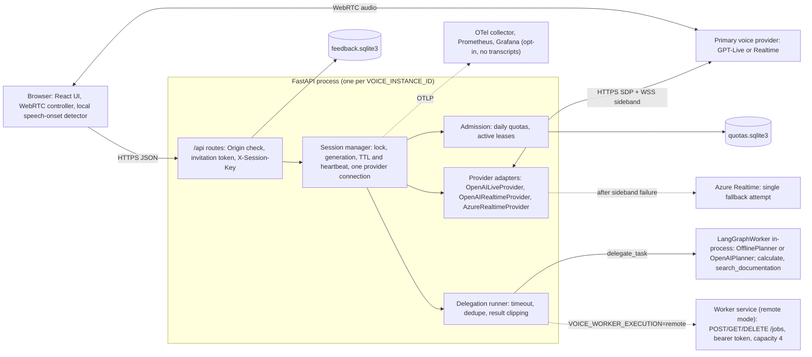

# voice-delegate

[](https://github.com/savbiz/voice-delegate/actions/workflows/ci.yml)
[](LICENSE)

**A reference architecture for real-time voice agents that stay responsive while doing real work.**

A speech-to-speech model (GPT-Live over WebRTC) owns the conversation. Anything slower than a
sentence is handed to a separate LangGraph worker through a single `delegate_task` boundary, and
narrated back when it completes. The user can interrupt at any time: an interrupted task is never narrated
after the interruption is registered. Backend-owned buffers, queues and sessions have explicit budgets; optional telemetry records
backend spans per turn.

Built clean-room from public provider documentation. Apache-2.0, copyright 2026 Savino Bizzoca.

<!-- TODO(v0.1.0): replace with docs/media/demo.gif recorded during the live smoke test:
     connect, ask a question, delegate a calculation, interrupt mid-answer, inspect timings, end. -->


```mermaid
flowchart LR
    B["Browser: React UI, WebRTC controller, local speech-onset detector"]
    subgraph API["FastAPI process (one per VOICE_INSTANCE_ID)"]
        R["/api routes: Origin check, invitation token, X-Session-Key"]
        SM["Session manager: lock, generation, TTL and heartbeat, one provider connection"]
        AD["Admission: daily quotas, active leases"]
        PA["Provider adapters: OpenAILiveProvider, OpenAIRealtimeProvider, AzureRealtimeProvider"]
        DR["Delegation runner: timeout, dedupe, result clipping"]
    end
    LW["LangGraphWorker in-process: OfflinePlanner or OpenAIPlanner; calculate, search_documentation"]
    RW["Worker service (remote mode): POST/GET/DELETE /jobs, bearer token, capacity 4"]
    Q[("quotas.sqlite3")]
    F[("feedback.sqlite3")]
    V["Primary voice provider: GPT-Live or Realtime"]
    AZ["Azure Realtime: single fallback attempt"]
    O["OTel collector, Prometheus, Grafana (opt-in, no transcripts)"]
    B <-->|WebRTC audio| V
    B -->|HTTPS JSON| R
    R --> SM
    R --> F
    SM --> AD --> Q
    SM --> PA
    PA <-->|HTTPS SDP + WSS sideband| V
    PA -.->|after sideband failure| AZ
    SM --> DR -->|delegate_task| LW
    DR -.->|VOICE_WORKER_EXECUTION=remote| RW
    SM -.->|OTLP| O
```

## Why it exists

Voice agents fail in two ways: they go quiet while a tool runs, or they keep talking over a
result that is no longer wanted. This project shows one way to avoid both:

- **One delegation entry point.** The voice model knows a single tool; the worker evolves and
  is tested on its own.
- **Interruption invalidates work.** A generation counter is bumped before cancellation, so a
  late worker result is discarded rather than narrated.
- **Bounded everything the backend owns.** Sessions, buffers, history, worker steps and
  result size have limits with a documented reason and a documented behaviour on exhaustion.
- **Provider failover with clamped history.** A primary transport failure reconnects to a
  fallback provider and replays bounded text, never tool executions.
- **Measured, not assumed.** OpenTelemetry spans per turn, provider time-to-first-byte,
  delegation latency and failover count; offline evals for scheduling and limits.
- **Fake provider for evals.** Reproducible failure sequences and injected clocks make
  lifecycle behaviour testable without credentials. Scripted tests verify orchestration;
  live model-quality and audio-latency measurements remain separate.

## Status

**v0.1.0: sessions, delegation, recovery, observability, invitations, cited search and
same-host scaling implemented; live voice, Azure and hosted acceptance pending**.
See the [roadmap](docs/roadmap.md) and [production scope](docs/production.md).

<!-- TODO(v0.1.0): fill from the live smoke test; keep p50/p95 and the exact model names.
| Measurement | p50 | p95 | Notes |
|---|---|---|---|
| Provider time-to-first-byte |  |  | gpt-live-1, WebRTC, EU |
| Delegated task end-to-end |  |  | offline planner / gpt-4.1-mini |
| Failover to Azure |  |  | injected sideband failure |
-->

## Quickstart — no API key required for the simulated demo

Prerequisites: Python 3.12, uv, Node.js 24 and pnpm 11.19.0. Open the repository folder containing `pyproject.toml`.

```bash
cd voice-delegate
uv sync --locked
cp .env.example .env
pnpm --dir frontend install --frozen-lockfile
pnpm --dir frontend dev
```

Open **http://localhost:5173** and press **Start demo**. This mode is free, scripted and silent: no API calls, microphone or generated speech. Simulated timings are labeled.

For live voice, set `OPENAI_API_KEY` in root `.env`, then in a second terminal from the repository root:

```bash
uv run uvicorn voice_delegate.api.app:create_app --factory --reload --host 127.0.0.1 --port 8000
```

Select **Live voice** in the browser. Provider access and usage billing are required. Keys stay on the server. Use one backend worker; sessions are held in memory.

See [PyCharm and local development](docs/local-development.md) and [GitHub, Vercel, Railway/Render deployment](deployment/README.md).

## Repository

| Directory | Responsibility |
|---|---|
| `.github/` | CI, CodeQL and dependency updates |
| `agent/` | LangGraph worker, planners, tools and bundled reference corpus |
| `backend/` | FastAPI, provider adapters, sessions, limits and offline tests |
| `deployment/` | Docker images, hosting instructions and same-host scaling |
| `docs/` | Architecture, decisions and historical verification records |
| `evals/` | Versioned worker datasets, quality reporting and scripted controls |
| `frontend/` | React UI, WebRTC controller, Vitest and Playwright |
| `observability/` | OTel collector, Prometheus and Grafana |
| `realtime/` | Browser/server WebRTC boundary documentation |
| `scripts/` | Reference generation, link checks and container smoke tests |
| `test_support/` | Shared deterministic test helpers |

## Session and delegation guarantees

- Application session creation and ownership keys; duplicate-offer protection.
- Server-mediated GPT-Live WebRTC SDP exchange and server-side event connection.
- Start/end browser controls, microphone cleanup, independent bounded captions, estimated per-turn transcript gaps.
- Absolute lifetime, browser heartbeat expiry, request size and session capacity limits.
- Bounded WebSocket/event queues and graceful close with explicit confirmed/unconfirmed finalization.
- LangGraph delegation with offline/OpenAI planners, timeout, result clipping and interruption cancellation.

Other implemented areas:

- [Voice controls](docs/architecture.md): language, translation mode, captions and interruption recap.
- [Cited documentation search](agent/README.md): local evidence with immutable source IDs.
- [Admission and feedback](deployment/README.md): invitations, durable quotas and bounded reports.
- [Provider recovery](docs/architecture.md): one fallback attempt with clamped text history.
- [Observability](observability/README.md): backend traces, counters and latency histograms.
- [Same-host scaling](deployment/README.md): instance routing, shared leases and a private worker.
- [Evaluation](evals/README.md): synthetic controls and separately reported worker quality.

GPT-Live uses native client delegation (ID and timestamp, no schema). The Realtime and Azure adapters register [docs/delegate_task.schema.json](docs/delegate_task.schema.json) as a server-owned tool and map function_call events to the same worker.

`delegate_task(goal, context)` is the internal worker contract. Delegation starts an asynchronous worker and returns compact commentary. `VOICE_WORKER_MODE=offline` uses a scripted planner by default; set `openai` for natural-language tool selection. No web search or external actions are available.

The capability-aware `/token` endpoint returns **501** for this adapter. Live's documented browser flow creates sessions using server credentials and SDP; this project does not invent a Live ephemeral credential API. The browser uses `/offer`. See [ADR 001](docs/decisions/001-live-client-delegation.md).

## Try the real worker offline

```bash
uv run python -m voice_delegate.delegation.demo "calculate (120 + 80) * 1.22"
```

This executes the LangGraph graph and calculator without any API call and returns 244. See [worker delegation](docs/milestones/m2.md) for enabling the paid text model and testing interruption.

## Verification

```bash
uv run ruff check .
uv run ruff format --check .
uv run mypy
uv run pytest --cov=voice_delegate --cov=voice_delegate_agent --cov-fail-under=85
uv run python scripts/check_links.py
uv run python scripts/build_reference.py --check
pnpm --dir frontend lint
pnpm --dir frontend build
pnpm --dir frontend test
pnpm --dir frontend test:e2e
uv build --all-packages
docker build -f deployment/Dockerfile.backend -t voice-delegate:ci .
uv run python scripts/smoke_container.py
```

CI runs the backend on Python 3.12 and 3.13, builds and smoke-tests the container on 3.12, checks release tag/version agreement on tag pushes, and rejects unresolved Vercel placeholders.

Pytest disables IP sockets; only local Unix sockets used by asyncio are allowed. HTTP tests use in-process ASGI and mock transports. Test fixtures contain invented identifiers and no recordings from private systems. Dependency installation needs internet; the tests themselves do not.

See [the live smoke-test checklist](docs/milestones/m1-verification.md). CI runs on hosted GitHub Actions, and paid text-worker evaluations are recorded in
[the evaluation verification record](docs/milestones/m9-evals-verification.md); live voice
and Azure calls have not yet been verified.

## Timing and cleanup limitations

The UI measures an **estimated transcript gap**, not audio TTFB or end-to-end playback latency. Transcript timestamps can overlap; negative values are retained. Turns are approximated by 800 ms gaps between user transcript fragments. The backend exports separate turn, provider, delegation and failover metrics; see [observability](observability/README.md).

The provider creation POST is never automatically retried: an ambiguous response can already have created a billable session. If the sideband fails after creation, the adapter attempts to recover it solely to close the session. If recovery fails, remote finalization cannot be guaranteed and is logged as unconfirmed. The public hangup reference describes SIP, so the Live adapter does not assume it works for WebRTC. A process crash also cannot guarantee remote cleanup. A normal close waits for `session.closed` before releasing transports.

## Roadmap and release gates

The full plan covers voice sessions through same-host scaling: see [scope, acceptance and status](docs/roadmap.md).
The table below covers the core features; later features extend them with a controlled
public demo, a complete use case, advanced voice UX and optional scaling.

| Feature | Release gate |
|---|---|
| GPT-Live sessions, provider contract, browser | Offline checks + real voice, interruption, and cleanup smoke test |
| LangGraph worker, internal delegation, token budget, cancellation | Offline worker tests + live delegated response |
| Azure Realtime adapter, renegotiation failover, clamped history | Capability checks and timed fallback scenarios |
| OTel, collector, Prometheus, Grafana dashboard, evals, docs | Reproducible offline suite + explicitly separate live validation |

Voice controls include language/translate preferences, an extractive interruption recap and OpenAI Realtime. Optional scaling adds a same-host multi-process topology. ElevenLabs and cross-host high availability remain future extensions.

The Azure adapter uses documented GA WebRTC and sideband capabilities. A provider change establishes a new browser peer connection and replays bounded text; it does not transparently migrate audio or imply identical full-duplex behavior.

## Public sources

Protocol implementation is based on the public OpenAI [WebRTC guide](https://developers.openai.com/api/docs/guides/voice-webrtc?api=live), [server controls](https://developers.openai.com/api/docs/guides/voice-server-controls?api=live), [session lifecycle](https://developers.openai.com/api/docs/guides/live-conversations), and [delegation guide](https://developers.openai.com/api/docs/guides/live-delegation). See [architecture](docs/architecture.md) and [ADRs](docs/decisions/) for application-level reasoning and feature boundaries.

## Documentation map

- [Architecture and API routes](docs/architecture.md)
- [Production scope](docs/production.md)
- [Configuration and operations](deployment/README.md), [local development](docs/local-development.md)
- [Provider terminology](realtime/README.md) and [worker contract](agent/README.md)
- [Architecture decisions](docs/decisions/)
- [Historical milestone records](docs/milestones/) and [current roadmap](docs/roadmap.md)
