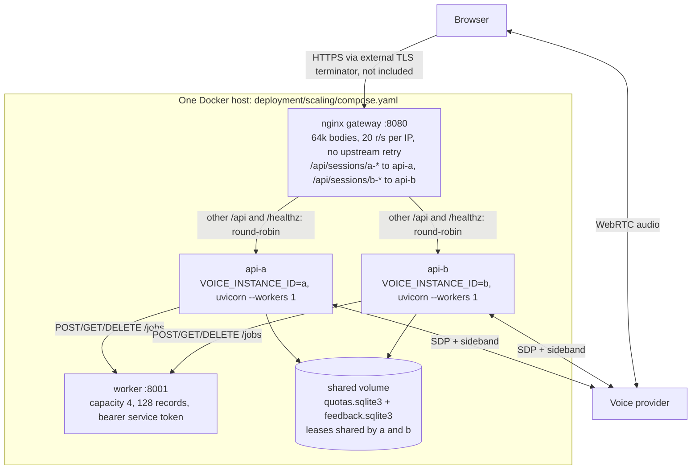

# Deployment

The frontend is deployed at `https://voice-delegate.vercel.app` and the canonical backend at `https://voice-delegate-api-production.up.railway.app` on Railway. Render is a supported alternative. Keep **one** persistent backend process. WebRTC media connects the browser to the provider; Python keeps the control WebSocket. Vercel serves the static frontend, not the Python session manager. The in-memory registry requires one replica and one Uvicorn worker. Restarting or redeploying interrupts active sessions.

## Frontend on Vercel

Import the GitHub repository. Set **Root Directory = frontend**, framework Vite, install `pnpm install --frozen-lockfile`, build `pnpm build`, output `dist`, Node.js 24. `frontend/vercel.json` supplies build defaults and concrete security headers. The simulated demo works immediately without a backend or API key.

Set the **public** build variable `VITE_API_BASE_URL=https://voice-delegate-api-production.up.railway.app` (no trailing slash), then deploy through the GitHub integration. Never place OPENAI_API_KEY or VOICE_ACCESS_TOKEN in a VITE variable: Vite embeds them in public JavaScript.

## Existing Railway deployment and Render alternative

Both platforms build `deployment/Dockerfile.backend` with the repository root as Docker context and one replica. The container reads `PORT`. Root `railway.json` records Dockerfile build, `/healthz`, and restart on failure. Keep the existing Railway volume mounted at `/app/.local`; do not create another service or volume.

Railway's legacy [Config as Code](https://docs.railway.com/config-as-code/reference) supports build/deploy settings, not volume provisioning or environment variables. Those existing dashboard resources are recorded in [railway-requirements.json](railway-requirements.json) and checked against Render by tests. Railway documents a 2026-12-01 cutoff for legacy config files; migration to its current IaC requires a separate reviewed import of the existing service. Do not apply an empty/new project definition. The dashboard Dockerfile variable remains configured on the deployed service.

Root `render.yaml` describes the supported alternative: one Docker service, protected public-demo mode and a 1 GB disk at `/app/.local`. No Render service is currently configured.

## Variables

Use this shared backend configuration. Secrets stay in platform dashboards; the table does not expose or certify their current values. In particular, replace the Railway API-key placeholder with a real key before live calls. Proxy settings below are the required profile and must be checked against the actual ingress before enabling them.

| Variable | Value |
|---|---|
| `OPENAI_API_KEY` | Backend project key, secret; a placeholder cannot authenticate provider calls |
| `VOICE_ENVIRONMENT` | `production` |
| `VOICE_PUBLIC_DEMO` | `true` |
| `VOICE_INVITE_TOKENS` | Secret JSON mapping invitation names to unique random tokens of at least 32 characters |
| `VOICE_ALLOWED_ORIGIN` | `https://voice-delegate.vercel.app` |
| `VOICE_ALLOWED_HOSTS` | Railway: `["voice-delegate-api-production.up.railway.app","healthcheck.railway.app","localhost","127.0.0.1"]`; Render: its assigned public hostname plus `localhost` and `127.0.0.1` for container checks |
| `VOICE_TRUST_PROXY` | `true`, after verifying trusted ingress |
| `VOICE_TRUSTED_PROXY_HOPS` | `1`, after verifying the chain below |
| `VOICE_QUOTA_DATABASE` | `/app/.local/quotas.sqlite3` |
| `VOICE_FEEDBACK_DATABASE` | `/app/.local/feedback.sqlite3` |

Railway's healthcheck hostname is required by [Railway healthchecks](https://docs.railway.com/deployments/healthchecks). Railway-specific `RAILWAY_DOCKERFILE_PATH` and `RAILWAY_RUN_UID` are described below; they are not shared application settings.

To verify the hop count, send `/healthz` from a known public IP and correlate its timestamp/request ID with a trusted ingress request log showing the socket peer and raw `X-Forwarded-For`. With one trusted hop, the rightmost entry must be the caller. Repeat with `X-Forwarded-For: 198.51.100.123` supplied by the caller: that prefix must not become the selected client. Count additional trusted proxies from the right. Standard Uvicorn access logs do not contain the raw header; use an ingress log or temporary restricted diagnostic logging of only peer and XFF, never authorization headers, invitations or bodies, and remove that logging afterwards. Do not claim the hop count is verified from a normal access log alone.

## Switching platform

The frontend CSP allows exactly one API host. To switch to Render, update `connect-src` in `frontend/vercel.json`, set the backend `VOICE_ALLOWED_ORIGIN` to the Vercel origin and `VOICE_ALLOWED_HOSTS` to the Render hostname, and change `VITE_API_BASE_URL` in Vercel. Update both deployment and frontend READMEs with that host, then redeploy the frontend. Move persistent quota/feedback data through the backup/restore procedure in [operations](../docs/operations.md); never discard existing daily reservations during a switch. CI checks the CSP host against both READMEs.

Generate each invitation token locally with `uv run python -c 'import secrets; print(secrets.token_urlsafe(32))'`. Assign each token a distinct invitation name and share it only with that user, who enter it in the frontend field. Keep it out of Git and build logs. Check `/healthz`, set Vercel's backend URL, redeploy the frontend, and test using the exact permitted origin. Preview deployment URLs are not automatically allowed.

The single shared `VOICE_ACCESS_TOKEN` mode is for private testing only. Public demos require named invitations and durable quotas. Origin checks alone do not authenticate callers. The Render blueprint provisions a 1 GB disk at `/app/.local`; Railway needs an equivalent persistent volume.

Hosting plans, sleep policies and quotas change: check the platform dashboards before accepting costs. A sleeping backend adds cold-start latency and cannot sustain active control sessions while asleep. The free frontend simulation needs no paid model; live provider calls are billed separately from hosting.

## Delegated worker settings

The Dockerfile includes both uv workspace packages (`backend/` and `agent/`). Keep the build context at the repository root. For natural-language work, add `VOICE_WORKER_MODE=openai` and `VOICE_WORKER_MODEL=gpt-4.1-mini` to backend service variables, with the existing project API key. This adds text-model usage charges. Leaving worker mode at its default `offline` uses a scripted planner. Worker configuration never belongs in Vercel's public build variables. See [worker execution](../docs/milestones/m2.md).

## Local container check

With Docker installed, from the repository root:

```bash
docker build -f deployment/Dockerfile.backend -t voice-delegate-api .
docker run --rm --env-file .env -p 8000:8000 voice-delegate-api
```

This container uses your local development origin unless production settings are supplied. `.env` is excluded from the image. Docker build, authentication, quota persistence and same-host scaling have recorded [Docker verification](../docs/milestones/m7-m8-verification.md#docker-acceptance-exercise). Public hosting and real voice acceptance remain separate checks.

Public references: [Vercel Vite](https://vercel.com/docs/frameworks/frontend/vite), [Render FastAPI](https://render.com/docs/deploy-fastapi), [Railway FastAPI](https://docs.railway.com/guides/fastapi).

## Controlled public demo

Use [Public-demo configuration and rollback](../docs/milestones/m5.md) before opening access to other users.
Personal invitation tokens replace a shared code in public-demo mode. Mount durable quota
storage at `/app/.local` owned by UID 10001, and keep one API worker. Reuse that volume across
image replacement and rollback. Admission reserves the full session allowance up front;
there are no refunds on failed creation. Local Docker checks cover authentication and
quota persistence after restart, not the availability of a publicly hosted deployment.

The [Documentation workflow](../docs/milestones/m6.md) is bundled with the agent and available
through the Documentation tab without a paid model call.


## Cost controls

Use separate project-scoped OpenAI service-account keys for this demo and development;
use a dedicated Azure OpenAI resource and resource-scoped key for the demo. Keep both on
the backend, rotate them, and restrict permitted models/deployments and access.

Set hard monthly budgets for both providers before inviting users:

- **OpenAI:** configure the project monthly spend limit and enable **Enforce a hard limit**;
  also set alerts below that threshold. Enforcement can lag tracked spend, so leave headroom.
  See [OpenAI spend limits](https://developers.openai.com/api/docs/guides/spend-limits).
- **Azure:** set a monthly Cost Management budget for the dedicated resource and connect
  budget alerts to a tested shutdown procedure that disables demo admission and stops
  billable provider access. Azure budgets alone do **not** stop consumption; alert data and
  automation can lag. An exact hard monthly cap cannot be promised by this configuration.
  If a strict ceiling is required, keep the public demo disabled until an enforced spending
  control is available and verified for the subscription. See
  [Azure budgets](https://learn.microsoft.com/en-us/azure/cost-management-billing/costs/tutorial-acm-create-budgets).

These application limits supplement provider spending controls; seconds are reserved
allowances, not currency or measured billing. Daily counters reset at UTC midnight.

| Setting | Default | Meaning |
|---|---|---|
| `VOICE_PUBLIC_DEMO` | `false` (blueprint: `true`) | Requires production configuration, named invites and durable quota storage. |
| `VOICE_INVITE_TOKENS` | `{}` | Up to 100 named, unique invitation tokens; identity for personal quotas. |
| `VOICE_QUOTA_DATABASE` | `.local/quotas.sqlite3` | Durable daily reservations and active-session leases; retain across restarts. |
| `VOICE_DEMO_ENABLED` | `true` | Admission kill switch; `false` rejects new sessions, without ending existing calls. |
| `VOICE_DAILY_SESSIONS_PER_USER` | `4` | Maximum session reservations per invitation per UTC day. |
| `VOICE_CONCURRENT_SESSIONS_PER_USER` | `1` | Maximum simultaneously active sessions per invitation. |
| `VOICE_DAILY_VOICE_SECONDS_PER_USER` | `1500` | Per-invitation daily reserved provider seconds. |
| `VOICE_DAILY_VOICE_SECONDS_GLOBAL` | `6000` | Daily reserved provider seconds across all invitations. |
| `VOICE_MAX_SESSIONS` | `4` | Total active session capacity; public-demo leases share the limit through the database. |
| `VOICE_SESSION_TTL_SECONDS` | `300` | Absolute session lifetime; heartbeats never extend it. |
| `VOICE_HEARTBEAT_TIMEOUT_SECONDS` | `45` | Expire sessions whose browser stops sending heartbeats. |
| `VOICE_MAX_DELEGATIONS_PER_SESSION` | `8` | Unique worker requests allowed per session; repeats do not create new work. |
| `VOICE_DELEGATION_TIMEOUT_SECONDS` | `15` | Deadline for each worker task. |
| `VOICE_WORKER_MAX_STEPS` | `4` | Maximum model reasoning steps per worker invocation. |
| `VOICE_DELEGATION_RESULT_TOKENS` | `120` | Spoken result token budget, additionally capped at 500 UTF-8 bytes. |
| `VOICE_WORKER_SERVICE_CAPACITY` | `4` | Concurrent tasks in the optional remote worker; excess work is rejected. |
| `VOICE_WORKER_MAX_RECORDS` | `128` | Maximum remote job/cancellation records retained at once. |

Each admission reserves `ceil(VOICE_SESSION_TTL_SECONDS + 1)` seconds, doubled when
`VOICE_FALLBACK_ENABLED=true` to cover both providers. Failed setup, early close and
interruption do not refund daily reservations. Active leases are released on close or
expire after the lifetime plus setup/close allowances. Text-worker token charges and
hosting/storage charges are separate from the voice-second allowance.

The API also limits each client IP to 20 HTTP requests/second with a burst of 100,
before reading request bodies. Buckets are per process, capped at 10,000 active clients;
the least recently used bucket is evicted when the table is full. IPv6 clients share a
/64 subnet bucket. Idle buckets expire after five seconds.
Keep `VOICE_TRUST_PROXY=false` for direct access. Behind trusted ingress set it to `true`
and set `VOICE_TRUSTED_PROXY_HOPS` (default `1`) to the number of trusted proxies,
including the socket peer. The Render blueprint enables `VOICE_TRUST_PROXY=true`
and `VOICE_TRUSTED_PROXY_HOPS=1`. Before exposing the demo, send a request from a
known public IP through the complete ingress path and confirm that the rightmost
header entry is that IP; repeat with a caller-supplied prefix to check append behaviour.
If an extra trusted CDN is present, verify and count its hop before updating the value.
With one hop the rightmost X-Forwarded-For entry is the client;
with two hops the final header entry is another trusted proxy, so the preceding entry is used.
Only the selected entry is parsed; malformed untrusted prefixes are ignored. An invalid
selected entry or a too-short chain falls back to the socket address. Direct backend access must
be blocked, and all routes must have the same trusted proxy depth. Run Uvicorn with
`--no-proxy-headers` so these settings exclusively control forwarded-header trust.

Render/Cloudflare ingress can append to an existing X-Forwarded-For chain: never trust
its leftmost entry, which a caller can supply. Count the actual ingress chain for the
platform and any additional CDN; do not assume one hop across a composed deployment.
[Cloudflare documents its append behaviour](https://developers.cloudflare.com/fundamentals/reference/http-headers/#x-forwarded-for).
The bundled Nginx overwrites the header with its verified peer address, so use one hop.
If a trusted TLS terminator is added, configure Nginx real-IP handling for that terminator
before forwarding the verified address. Host-mismatch requests also consume the API bucket.
Multi-process/global limits require an external shared limiter.

For the bundled Compose deployment, set `VOICE_ALLOWED_HOSTS` to a JSON array of
the public API hostnames, alongside `VOICE_ALLOWED_ORIGIN` for the frontend origin.
The local smoke-test default accepts only localhost and 127.0.0.1.


## Frontend response headers

`frontend/vercel.json` applies CSP, Permissions-Policy, Referrer-Policy and
X-Content-Type-Options to every route. Its CSP permits API connections to
`https://voice-delegate-api-production.up.railway.app`. Set the same origin in
Vercel's public `VITE_API_BASE_URL` build variable and redeploy after changing it.
This hostname is public configuration, never a provider credential.

The policy restricts scripts, styles, images and media to the frontend origin, blocks
objects and embedding, and permits form submissions only to the same origin.
Changing API deployments requires updating both the committed CSP hostname and
`VITE_API_BASE_URL`. CI rejects unresolved placeholders in `frontend/vercel.json`.

## Railway volume permissions

The image runs as the unprivileged `app` user (UID 10001), while Railway mounts
volumes as root. If SQLite cannot open its files under `/app/.local`, verify the
mount path and database paths, then follow Railway's documented compatibility
setting `RAILWAY_RUN_UID=0`. This runs the application as root inside the container;
it is a platform-specific exception to the image's default user, not a change to
local or Render deployments. Keep quota and feedback files on the mounted volume.
See [Railway volume permissions](https://docs.railway.com/volumes#permissions).

## Same-host scaling topology



The gateway's dedicated `/healthz` location bypasses its request limiter; application middleware still applies. This topology does not migrate live sessions after an owner crash. See [architecture](../docs/architecture.md), [operations](../docs/operations.md) and [production scope](../docs/production.md).
